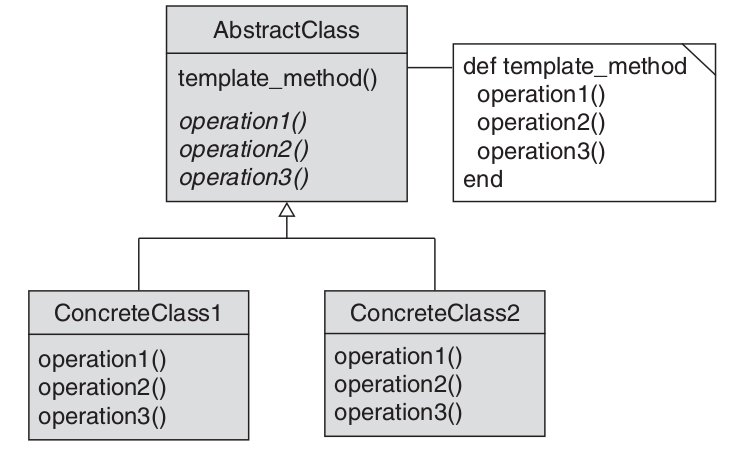

GoF patterns implemented in ruby.

Examples implemented based on samples from book **Design Patterns in Ruby - Russ Olsen, 2007**.

Currently we have:

* [Template method] (#template-method)

## Main aspects:

1. Separate the things that change from those that stay the same:
  * improves maintainability
  * easier to introduce a change
  * promotes DRY code

2. Program to an interface, not an implementation:
  * increases modularity
  * code becomes more change resistant

3. Prefer composition over inheritance:
  * increases encapsulation
  * increases usability

4. Delegate, delegate, delegate:
  * flexibility

  **Note**: there is a cost of delegation - extra method call and boilerplate code.

5. You ain't gonna need it:

  Do not implement things that you don't need.

## Template method

Method pattern is simply a fancy way of saying that if you want to vary an algorithm, one way to do so is to code the invariant part in a base class and to encapsulate the variable parts in methods that are defined by a number of subclasses.

**Note**: duck typing has an important role here for dynamic languages.
